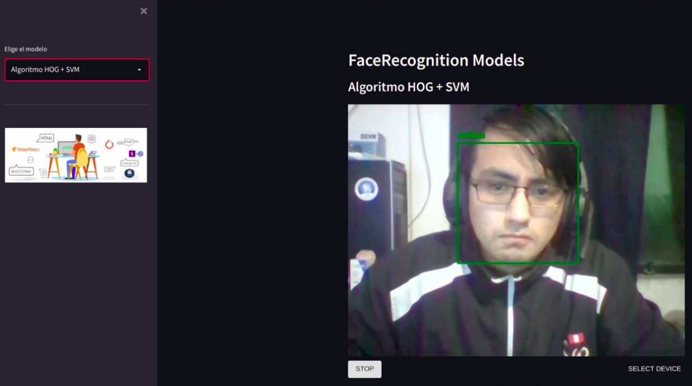

<p align="center">
    <br>
    <a href="https://www.facebook.com/acecom.uni">
    
    </a>
    <br>
</p>

<h2 align="center">
<p>faceAcecom V2 😄</p>
</h2>
Construido con Tensorflow 2 y Streamlit.

## 📑 Instalación de los paquetes

- Para poder ejecutar este proyecto le recomendamos encarecidamente use ANACONDA o _pipenv_ para poder manejar sus entornos de trabajo y no tener problemas de incompatibilidad.
- Una vez que tiene su entorno creado y **activado**, ejecute el siguiente comando en terminal:

```bash
pip install -r requirements.txt
```

Esto puede tomar un poco de tiempo, asi que tenga paciencia!

- Eso es todo, estas listo para pasar a la siguiente sección.

## 💻 Instrucciones

Para poder recopilar datos ejecute desde **terminal**:

```bash
python createDataset.py
```

Se abrirá una ventana y comenzará a capturar imágenes, para posteriormente guardarlas en la carpeta `dataset` (debe crear la carpeta) de acuerdo al nombre de la persona que usted ingrese. Luego, para convertir las imágenes en matrices numpy y guardarlas en la carpeta `npy` (debe crear la carpeta), ejecute el siguiente comando:

```bash
python createNpy.py
```

Posteriormente ejecute todas las celdas del cuaderno `SVM-HOG.ipynb` y `faceNet.ipynb` (en ese orden). Y eso es todo, esta listo para probar la aplicación, ejecute el siguiente comando.

```bash
streamlit run app.py
```

## 👁️ Muestras

<p align="center">
  
</p>
<p align="center">
  
</p>
<p align="center">
  
</p>
